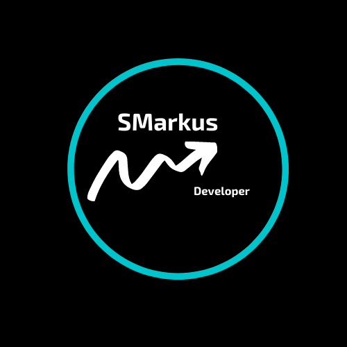
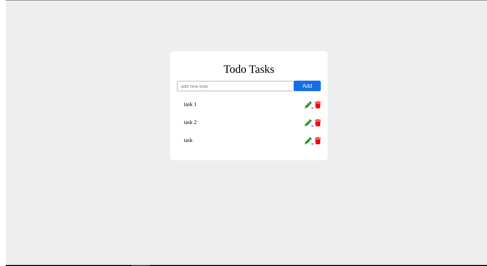

<p align="center">
  
</p>
<h1 align='center'>🚀 Um todo em Django 🚀 </h1>
Um todo feito com django/python, realizando CRUD de tarefas.
<h2>Layout</h2>
  
  
<h2>Como Executar o projeto 🚀</h2>

```bash

# Clone este repositório
$ git clone git@github.com:SMarkus27/Django-ToDo.git

# Acesse a pasta do projeto no terminal/cmd
$ cd Django-ToDo

# Vá para a pasta ToDo
$ cd ToDo

# rode o comando para a criação de um ambiente virtual:
$ python -m pip venv todo

# ative sua venv:
$ source todo/bin/activate

# Instale as dependencias que estão no arquivo requeriments.txt na pasta ToDO.
$ pip install requeriments.txt

# Execute a aplicação em modo de desenvolvimento
$ npm run dev:server

# agora na pasta ToDo
$ python manage.py runserver

# O servidor inciará na porta:8000 - acesse http://127.0.0.1:8000 

```

<h2>Tecnologias usadas</h2>
<ul>
  <li>HTML5</li>
  <li>CSS3</li>
  <li>Django/Python</li>
</ul>
 📝 Licença

Este projeto esta sobe a licença [MIT](./LICENSE).

Feito  por Marcus Vinicius 👋🏽 [Entre em contato!](https://www.linkedin.com/in/marcus-vinicius-campos=pereira)
