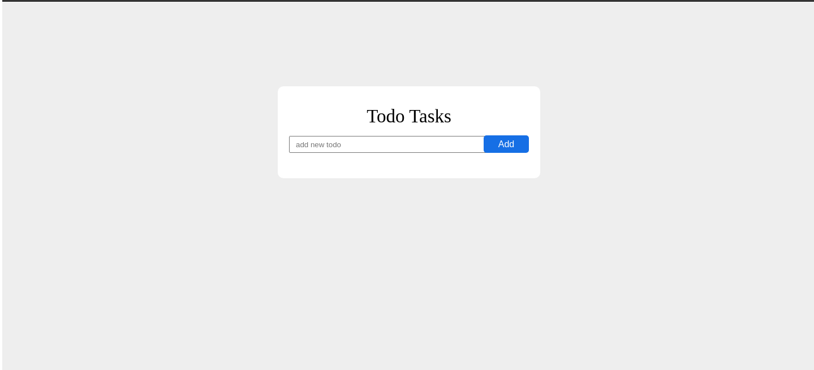

  

<h1 align='center'>🚀 Um todo em Django 🚀 </h1>
Um todo feito com django/python, realizando CRUD de tarefas.
<h2>Layout</h2>
  
  
<h2>Como Executar o projeto 🚀</h2>

# Introduction
This is a simple Todo application built off Django.

# Requeriments
* Python 3
* Pipenv

# Features
* Create a new task
* Delete a task
* Edit a task
